Feature Reference
*****************

The following chapter explains all the different tools and features in Prism. It is not a step by step guideline about how to work with Prism, instead it explains the individual features, which can be used in different combinations during a project.

.. _Installation:

Installation
===================

Installing on Windows
--------------------------------

`Download <https://prism-pipeline.com/downloads/>`_ Prism, run the executable and follow the instructions of the installer.
In some cases, Windows displays a warning, because the source of the installer is unknown to Windows.

You can ignore this warning by clicking on "More info" and then on the "Run anyway" button.

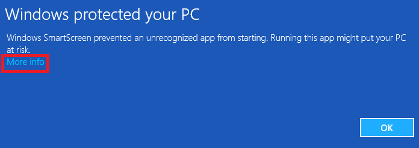

Follow the installer instructions:

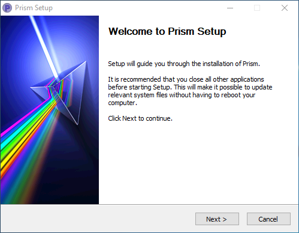

After the files are extracted, an additional :ref:`installation dialog<dlgInstallation>` opens.

Prism will be installed into this location by default, but you can change the location during the installation:

C:/Prism/*

After the installation the Prism Tray Icon starts, where you can open or create a new project.
On the last page of the installer there is a checkbox called "Setup integrations". This dialog let's you setup the Prism integration in all your installed DCC apps.

After the installation you can find the "PrismTray", "PrismProjectBrowser" and the "PrismSettings" items in the windows start menu.
By default, the Prism Tray icon will start, when you start Windows. You can disable this in the "Miscellaneous" tab of the Prism Settings dialog.

Installing on Linux
--------------------------------

`Download <https://prism-pipeline.com/downloads/>`_ Prism, extract the archive and move the folder to the location where you want to have Prism installed.
In the Prism directory start the "Prism_Setup_Linux.sh" file with root privileges. You can do this by opening the terminal in the directory and typing:

``sudo ./Prism_Setup_Linux.sh``

This will setup your Prism integrations in your DCC apps and it will setup some startmenu entries.
After the installation you can open Prism from the start menu, from the PrismProjectBrowser desktop icon or in any supported DCC app. After the next system restart a Prism Tray icon will be visible, which allow you to access all the Prism tools by right-clicking on it. (you can also start the tray icon from the start menu)

**Dependencies:**

|

*FFmpeg:*

FFmpeg is needed to convert image sequences to videos or into other image formats. It is also needed to playback previews of video files in the Project Browser. You need to install `FFmpeg <https://www.ffmpeg.org/>`_ and make sure the "ffmpeg" command is available on your system.

FFmpeg **3.0** or higher is required.

Ubuntu:

``sudo apt-get install ffmpeg``

On CentOS you can get the latest FFmpeg version here:

``sudo yum update``

``sudo yum install epel-release``

``sudo yum-config-manager --add-repo https://negativo17.org/repos/epel-multimedia.repo``

``sudo yum install ffmpeg``

|

*PIL:*

If you don't see preview images of .jpg files in the standalone Project Browser, you need to install the python imaging library (PIL):

Ubuntu:

``sudo apt-get install python-pil``

CentOS:

``sudo yum install python-imaging``

|

*OpenImageIO:*

To preview .exr images in the Project Browser you need to install the OpenImageIO python library on your system. You can install it like this:

Ubuntu:

``sudo apt-get update``

``sudo apt-get install python-openimageio``

CentOS:

``sudo yum update``

``sudo yum install epel-release``

``sudo yum install python-OpenImageIO``

Alternatively, you can find some builds `here <https://pkgs.org/download/python-openimageio>`_. If OpenImageIO is not available, Prism will fall back to the "ImageMagic" library (if available on your system).

Installing on Mac OSX
--------------------------------

`Download <https://prism-pipeline.com/downloads/>`_ Prism, mount the .dmg file and copy the Prism folder and the Prism_Setup_Mac.command file to the location, where you want to have Prism installed.
in the Prism directory start the "Prism_Setup_Mac.command" file with the "Open" option in the context menu. You are asked to enter the root password in order to install Prism.

After the installation you can open Prism from the TrayIcon from the PrismProjectBrowser desktop icon or in any supported DCC app. The TrayIcon allows you to access all the Prism tools by right-clicking on it.

**Dependencies:**

|

*OpenImageIO:*

To preview OpenEXR images in the Project Browser you need to install OpenImageIO on your system by entering the following in a terminal:

``brew install openimageio``

You can find more infos about installing OpenImageIO `here <https://tomasroggero.com/notes/how-to-install-openimageio-in-mac-os-x-el-capitan/>`__

.. _dlgInstallation:

Installation dialog
--------------------------------

The installation dialog lets you select for which programs you want to install the Prism integration.

.. image:: images/installer.png

DCC integrations:
All supported DCC applications are listed here. The installer automatically detects which DCCs you have installed on your PC and enables the corresponding options. In most cases you can leave all settings to default. The "custom" options for 3ds Max and Maya can be used to install Prism for additional versions like 2016.5.

If you want to install Prism for a different DCC version, you can double click a path on the right side of the dialog. For 3ds Max and Maya this only works in the "custom" line. A new dialog opens and lets you select a different path (for example to install Prism for an older Houdini version).

You can also add and remove DCC integrations of Prism after the installation in the "DCC apps" tab of the Prism settings.

Uninstall
--------------------------------

To uninstall Prism, you have to execute the "Uninstall" file in the Prism installation directory.
This will remove all Prism integrations and startmenu entry of Prism. Then you can delete the Prism installation directory manually.
In some programs (like Houdini) the Prism shelf needs to be deleted manually. Your projects, scenefiles and renderings will remain unaffected.

Updating Prism
--------------------------------

You can update Prism simply by installing another version of Prism. It's not necessary to uninstall the previous version.

The installer which you can find on the downloads page of the Prism website is the latest stable release. If you want to use the latest feature additions and bugfixes you can update your Prism version to the latest "development" version, which is available in the official Prism GitHub repository.

To update your current Prism version to the latest development version, open the Prism Settings dialog, for example from the Windows startmenu or the Prism Tray. In the "General" tab you can find a "Update" section with an "Check now" button. Click this button to check if there is a newer version available an if so follow the instructions to update your Prism version.

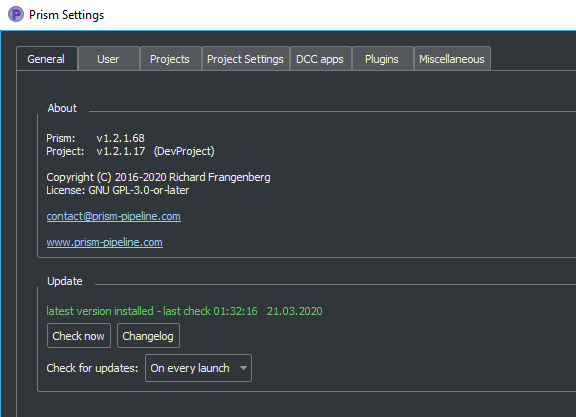

You can install a Prism version from a zip file (like the one which you can download manually from GitHub), by rickclicking on the "Check now" button and selecting "Update from .zip".

If you encounter problems during the update process, try to update from the standalone Prism Settings dialog and not from inside any DCC app.

Integrations
===================

3dsMax
--------------------------------
In 3ds Max Prism can be accessed from the "Prism" menu in the main toolbar.

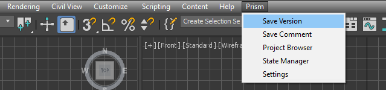

You can also access the Prism tools in the "Customize User Interface" dialog in 3ds Max. You can find them in the group "Main UI", category "Prism" and add them to a custom toolbar.
You can also find the tools in the global 3dsMax search (pressing "x" in the viewport), by typing the names you can find in the Prism menu (like "Project Browser" or "State Manager")

Blender
--------------------------------

In Blender Prism can be accessed from the "Prism" panel on the left side of the Blender window.

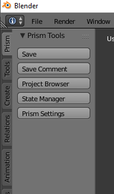

You can also type the names on the buttons (like "Project Browser") in the global search ("space" button) to open the Prism tools.
Due to some limitations in Blender, the Prism dialogs will be always on top of other dialogs from Blender and other programs.

In the Blender integration you have the option to save every test rendering from Blender. You can enable this feature in the Prism Settings dialog. Go to the "DCC apps" tab and then to the "Blender" tab. Here you can enable the "Auto save renderings" checkbox.
If this is enabled, every image you render in Blender will be saved to the specified location. The "use path only for current project" lets you set this path globally or different for every Prism project. Renderings which will be rendered through the Prism State Manager will not be saved to this folder.
The idea behind this feature is to have all test renderings saved, when iterating on different lighting setups and to see the progress afterwards.

Renderpasses:

Prism handles renderpasses in Blender differently than in other applications. You can view all active renderpasses in the ImageRender state settings in the StateManager, but you cannot delete or create new states here.
In order to let Prism recognize your renderpasses you need to go to the "Node Editor" in Blender and enable the "Use Nodes" checkbox for the "Compositing" compositing context. Here you have "Render Layers" node with all available renderpasses as output. You can add more renderpasses in the Blender "Properties" panel in the "Render Layers" tab. Create a "File Output" node in the Node Editor and connect all renderpasses from your "Render Layers" node to an input of a "File Output" node. You can use multiple "Render Layers" nodes and multiple "File Output" nodes if you like. Now Prism displays all connected passes in the ImageRender state. Prism takes care of the output paths in the "File Output" nodes, but you can modify all other settings on this node. Usually you want to set the filetype to OpenEXR Float(half). In case you modify the passes between the "Render Layers" node and the "File Output" node (for example with a Mix node or a Gamma node) Prism uses the "Label" setting of the node which is connected to the "File Output" node as the name of the renderpass (or "beauty" if the "Label" setting is empty).

Fusion
--------------------------------

In order to use Prism within Fusion, you need to set up Python scripting in Fusion by installing Python (2.7) on your computer.
In Fusion Prism can be accessed from the "Prism" sub-menu in the "Script" menu of the main toolbar.

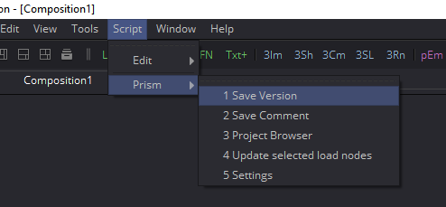

To import images from your Prism project, you can right-click on the preview in the Project Browser and choose "Import images...".
To write out images to your current Prism project you can use the "WritePrism" Macro in the Flow graph. (Context menu of the graph->Add Tool->Macros->WritePrism)

Houdini
--------------------------------

In Houdini you can access the Prism tools from the Prism shelf in the top left shelf set.
If the shelf is not visible on your computer (for example because you use another Houdini desktop), you can add the "Prism" shelf from the list of available shelves to any shelf set. The Prism shelf is being created during the Houdini startup if it doesn't exist yet. To reset it to the default state you can delete the shelf and restart Houdini.

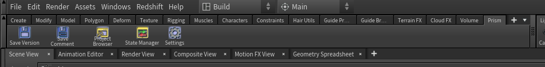

The Houdini integration of Prism comes with a custom HDA for quickly caching geometry or simulations to disk. In the "Geometry" context you can create a "PrismTmpCahce" node. You can connect some input, press the "Save to Disk" button and disconnect the input. The PrismTmpCache node will then read the .bgeo files from disk. This is a quick way of caching out temporary data, without the need to set output paths. The caches will be saved in subfolders at 03_Workflow/Caches/ in your current Prism project, so you can access these caches even after reloading your scenefiles.

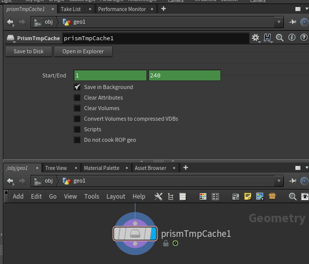

Maya
--------------------------------

In Maya you can access the Prism tools from the Prism shelf.

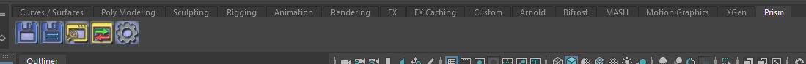

*Some users experienced missing icons on the Prism shelf. In most cases this could be fixed by deleting the shelf manually and reinstalling Prism/adding the Maya integration in the Prism Settings.*

Natron
--------------------------------

In Natron you can access the Prism tools from the Prism menu on the main toolbar.

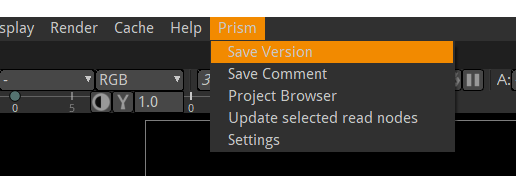

To import images from your Prism project, you can right-click on the preview in the Project Browser and choose "Import images...".
To write out images in Natron, you can use the WritePrism node ("Other"->"WritePrism")

*If Natron crashes on startup after you added the Prism integration you can fix this by disabling the Natron "Check for updates on start-up" option in the Natron preferences. Remove the Natron-Prism integration in the Prism Settings dialog, start Natron, disable the check-for-updates option and add the Prism integration again through the Prism Settings dialog.*

Nuke
--------------------------------

In Nuke you can access the Prism tools from the Prism menu on the main toolbar.

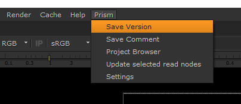

To import images from your Prism project, you can right-click on the preview in the Project Browser and choose "Import images...".
To write out images in Nuke, you can use the WritePrism node ("Prism"->"WritePrism")

Photoshop
--------------------------------

To access the Prism tools in Photoshop you have multiple options.
The first one is from the menu under File->Scripts

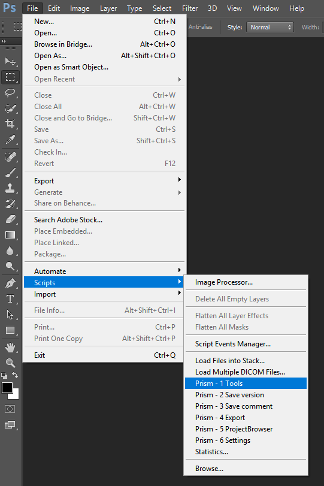

The second option is when you start a .psd file from the standalone Project Browser, a small window "Prism Tools" opens with all the Prism tools accessable. You can move this dialog to the side, while you are working and use it to quickly access the Prism tools.

The third option is to open a standalone Project Browser. On the main menu bar you can select "Options"->"Photoshop"->"Connect". This will connect the Project Browser to an open Photoshop instance or it open a new Photoshop instance, if Photoshop isn't running. When the Project Browser is connected to Photoshop you can select "Options"->"Photoshop"->"Open tools" to open a small window, which lets you access all the Prism tools.

The Prism dialogs will be always on top of other dialogs from Photoshop and other programs.

Standalone
--------------------------------

The standalone version of Prism can be opened from the Prism Tray icon or from the start menu. You can use it to browse scenefiles, renderings or set project settings, but you cannot create exports, renderings or playblasts from it.

Prism Dialogs
===================

Create Project
--------------------------------

Opening the "Create Project" window
++++++++++++++++++++++++++++++++++++++

When you haven’t created a project yet, click on the Prism tray icon or try to open the ProjectBrowser or the StateManager in your 3d application from the Prism shelf. A window will open to ask you to open an existing or to create a new project.

When you already have a current project, you can open the "Create Project" window from the "Prism Settings" dialog. You can open the "Prism Settings" from the context menu of the Prism tray icon, from the Prism shelf in your 3d application or from the options menu in the ProjectBrowser or the StateManager. Go to the "Projects" tab and click on the "Create new Project" button.

Create Project dialog
++++++++++++++++++++++++++++++++++++++

The "Create Project" dialog lets create a new Prism Pipeline project and edit the settings of the new project. Each setting has a tooltip. Hover over a setting to get additional information. Most settings can be changed later on in the "Project Settings" tab of the "Prism Settings".

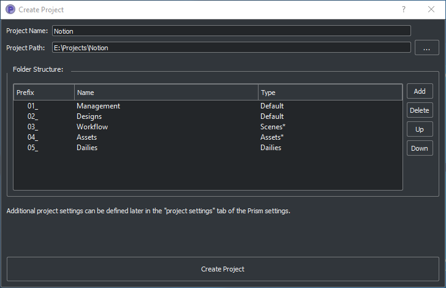

**Project Name:**

This is the name of the new project. The name is used at different places in the Prism Pipeline. For example, it shows up in the window title of the ProjectBrowser. The name doesn’t need to be included in the project path.

**Project Path:**

Here you can enter a path, where you want to save the new project. All files that Prism will create (scenefiles, exports, renderings…) will be saved at this location. Usually you want this directory to be empty or not existent. The project name will NOT be appended to this path automatically. The "…" button lets you browse your PC to select a folder.

**Additional local project folder:**

This is a very important feature, when you are working in a team on the same project. This option lets you define a location for your local project files. When this option is enabled, Prism will save most files in the local project folder and only files, which are relevant to other people, are saved to the main project folder. When you create new scenefiles, these files are saved in the local location by default. When you publish your scenefile, the file will be saved in the main project folder. When creating exports, playblasts and renderings, there is on option in the StateManager, which lets you define, whether the files should be saved to the local location. Local files can be moved to the main project folder in the project browser from the context menu of the scenefile/version.

This is very useful if your main project folder is on a network location or synchronized to a cloud and you want to reduce the network traffic.

The path for the local project path is only used for the current PC. When the checkbox is enabled, and another PC opens the project, a window will show up, where the user has to set a local path for the PC.

**Folder Structure:**

Here you can define the top-level folder structure, which will be created in the project path. The buttons on the right side lets you customize the structure. Double-click on a folder name to edit it and Double-click on a type to change it to another folder type. Available types are: "Default", "Scenes", "Assets", "Dailies". Every type can only be set once except "Default". Folders with the type "Default" are not handled by Prism and no files are saved in them automatically. You can use them to place your own files in there like concepts, management plans, notes… . All types with an asterisk need to be set before creating the project ("Scenes" and "Assets"). In the scenes folder all scenefiles, exports, playblasts and renderings will be saved. Prism handles the folder structure in there automatically. The "Assets" folder will be used to save textures, external models, HDRIs and so on. The dailies folder is used by the Prism tray icon. Click here for more information.

You can create additional folders in the project folder manually later in the windows explorer.

**Force program versions:**

When this option is enabled, you can set a program version for each DCC integration. When someone opens a program with a different version, a warning will show up to notify the user, that he is using a wrong version. This helps to ensure, that everyone in the project uses the same software version. Using different software versions can lead to incompatibility problems, when someone wants to open a scene, which was saved with a different version. The buttons on the right side give you some presets, but you can also type a different version in the version field.

This option doesn’t prevent the use of a different software version, it only warns the user.

**Shotgun integration:**

When this option is enabled, you can enter your Shotgun information, which are needed to use the Shotgun related features of Prism. See the Shotgun integration page for more information.

.. _dlgUserName:

Change User dialog
--------------------------------

The "Change User" dialog will show up, when no username is saved in your preferences and you try to open some Prism tools.
You can also change the user name in the "User" tab of the Prism Settings dialog.

This username will be used to identify who created a scenefile in Prism.
It has to be at least one character for the first name and two characters for the last name.
The user name will be used globally for all your projects, but it can be changed anytime.

Project Browser
--------------------------------

The Project Browser is one of the most important tools in Prism. It allows you to create assets/shots, manage your scenefiles and browse your renderings or playblasts.

.. image:: images/ProjectBrowser.png

The upper half of the Project Browser contains three tabs:

**Assets:**

This tab lets you organize your scenefiles for assets like characters or environment, which will be used in shots later. You can create new entities in the "Hierarchy" list by double-clicking on it or from the context menu. You can create folders to group your assets or sub-folders. For example, you could create a group "Character", which contains a folder "Creature", which contains the assets "Alien-A" and "Alien-B". Assets or bold, while folder are in regular type. When you have selected an asset in the hierarchy, you can create pipeline steps in the "Steps" list by double-click or from the context menu. The "Select Steps" dialog shows up and lets you select one or more steps, which will be created. You can also create new pipeline steps in this dialog. To remove existing steps, you have to edit this file in your project directory: *00_Pipeline/pipeline.ini*
With the default project configuration underscores are not allowed in assetnames and stepnames. You cannot enter underscores in the name field when creating them in the Prism UI. If you have to use underscores you can change the setting "filenameseparator" in the project config to any different character. That character won't be allowed then in assetnames.

When you have a step selected, you can create new scenefiles in the files list from the various options in the context menu. The color on the left side of the version determines the file type. Every DCC app has a different color. For example, orange means it is a Houdini scene. To open a scenefile double click on it.

**Shots:**

The shots tab works much like the Assets tab. When you create a new shot, you can also define a frame range and a preview image. The frame range is a guideline when working in the scenefiles and can be applied to the scene easily, but it is not forced anywhere. The preview image be set in this dialog, but also from the context menu of the preview image at the lower right corner of the Project Browser: "Set as shotpreview". To edit the shot settings, you can open the "Edit shot" dialog from the context menu of the shot or when you double click on the shotpreview.

The Shots tab has also a "Categories" list. One scenario, where this can be useful: When you have a shot with an FX step and you have multiple simulations in this shot. Then you can create a category "Fire", a category "Dust" and a category "Fluid" in order to separate this simulations into different scenefiles.

**Recent:**

The recent tab show you the last 10 scenefiles, which you opened with Prism. This can be scenes from the asset or from the shots tab. You can open them by double clicking on it.

The lower half of the Project Browser contains the "Renderings" section, where you can browse your 3d/2d renderings, playblasts and external media.

The first list "Tasks" depends on your selection in the upper half of the Project Browser. It displays the tasks of the currently selected asset or shot. You create new tasks in your scenefiles from the :ref:`State Manager<dlgStateManager>` or by creating External Tasks.
When you select a task, the "Versions" list updates to display all versions of the currently selected task. When a version from a 3dRender task is selected, you can select a render layer (or render pass) from the "Layer" dropdown. The image preview on the right shows you the media of the selected version/layer with some information on top. You can double click the preview to open the media in RV or DJV (if it is installed on your system). You can also drapg&drop the media from the preview into other programs.

If you have RV installed, you can use the "RV Compare" list to add multiple versions to the list and compare the in RV. When you right-click on the compare button you have multiple options of compare types.

.. _dlgStateManager:

State Manager
--------------------------------

The State Manager lets you manage your imported and exported objects. It is also used to create playblasts and renderings. The State Manager is only available in the Prism integration for 3d DCC apps.

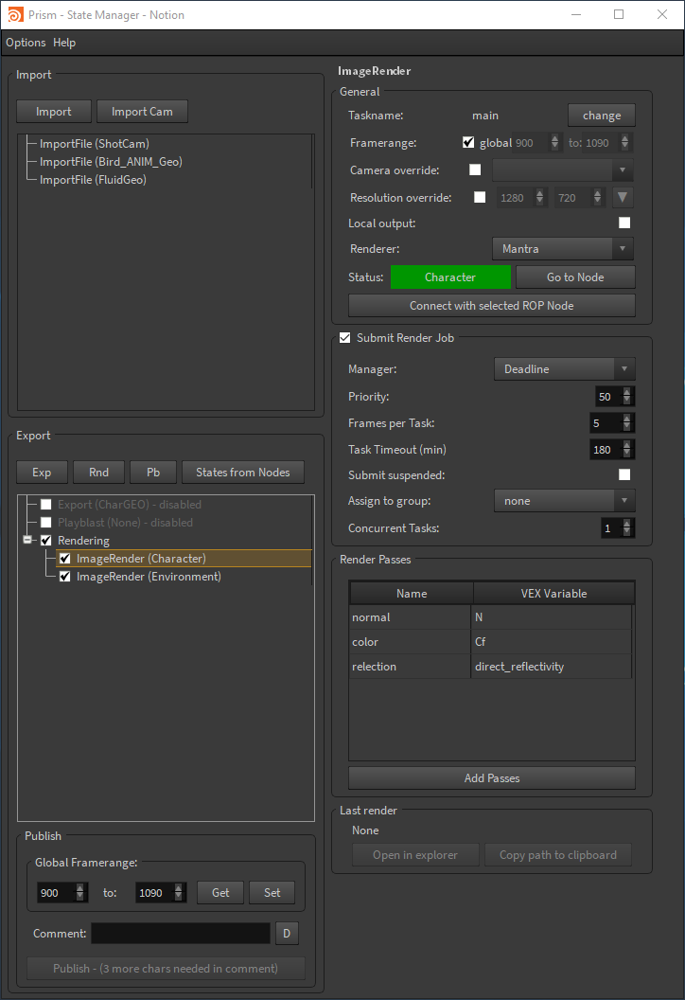

You can open the State Manager from the Prism menu/shelf or from the main menu of the Project Browser.

On the left side of the StateManager you have two lists. The upper one is for imports and the lower one for exports (playblasts and renderings are considered as export). You have to create states in these lists in order to perform an action.

On the right side of the State Manager you can see the settings of the currently selected state on the left side. 

You can create new states from the buttons above the lists, from the context menu of the lists or by pressing tab on your keyboard, when you have focused a list.

These are the available state types:

**ImportFile:**

The ImportFile state is used to import new objects into your current scene.
When you create an ImportFile state, the "Select task" dialog shows up. Here you can select any previous export from your current project to import it. You can also import external files by using the "Import custom files" button.

**Export:**

The Export state is used to export objects from your current scene. You can select from a list of export formats and define other settings. In Houdini you can submit your exports as a renderjob to Deadline or Pandora. You can import the exported files later through the ImportFile state.

**Playblast:**

The Playblast state create a viewport preview of your current scene. The playblast will be visible in the "Renderings" section of the Project Browser.

**ImageRender:**

This state lets you create renderings from your current scenefile. You can render locally or submit a renderjob to Deadline or Pandora (if installed).

**Folder:**

The Folder state is the only state, which is available in both the import- and the export-list.
It is used to group multiple other states.

**Dependency:**

This state is only available in Houdini. It can be used to make renderjobs dependent on each other on your renderfarm. For example, you can create an Export state to export a simulation, create a dependency state and select the export rop and create an ImageRender state, which will be dependent on the export and will start to render, when the export is done. In Deadline this create a frame-dependency. That means as soon as one frame of the export-job is completed, the corresponding frame of the render-job can start rendering by other renderslaves.

To start the exports/playblasts/renderings you have to execute the states. You execute states by publishing your scene with the button on the lower left corner of the State Manager. During the publish your scenefile will be saved to a new version and all checked states in your export list will be executed.

The "Global Framerange" setting will be used for states, which have the "global" checkbox next to the "Framerange" setting enabled. This can be used to change the execution range of multiple states at once.

You can also execute state from the context menu of a state. Here you can also execute a state as previous version. Normally when executing an ImageRender state, it will create a new render version. If you execute a state as previous version, you can render into an existing version in order to complete missing frames or overwrite existing frames.

.. _dlgPrismSettings:

Prism Settings dialog
--------------------------------

The Prism settings dialog contains global settings, which are saved on your current computer. It can be opened from multiple locations, like the start menu, the tray icon or the Prism menu/shelf in your DCC app.

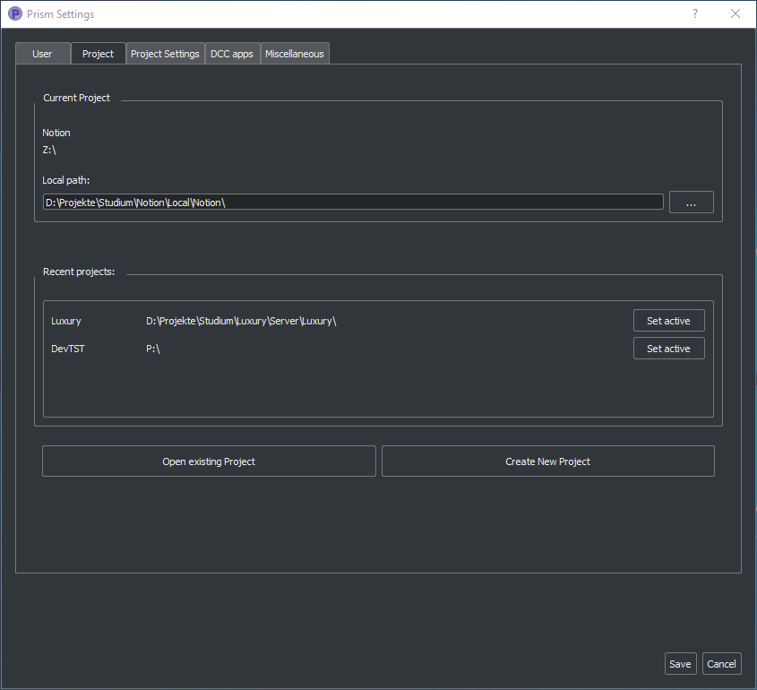

The dialog contains multiple tabs:

**User:**

Here you can set a :ref:`user name<dlgUserName>`

If the Shotgun integration is enabled in your current project, you can also define a Shotgun username and password of an existing Shotgun account, which will be used when creating Shotgun versions.

**Project:**

Here you can see your active project, switch to existing Prism projects or create a new one.

**Project Settings:**

This is the only tab in the Prism Settings dialog, which can change settings, which can affect other users.
The settings in this tab are applied to the project and therefore also apply to all users of the project. You can change the settings anytime during a project, but you may need to restart your Prism dialogs/DCC apps to apply them completely.

**DCC apps:**

This tab contains a sub-tab for each supported DCC integration plugin. These plugins a loaded dynamically from the "Plugins" folder in your Prism installation. The settings in these tabs can be different for every plugin, but most plugins contain options to override an executable when starting a scenefile in the standalone Project Browser and the options to add/remove DCC integrations.

**Miscellaneous:**

In this tab you can find some general Prism settings. You can also define explicit paths for RV or DJV, if they couldn't be found automatically by Prism.

Plugins
===================

Overview
--------------------------------
Prism uses a plugin structure to manage the integration and communication with external tools. Adding and removing support for an external tools can be done easily by creating or deleting a Prism plugin.

Plugins can also be used to customize any existing features of Prism. It is preferrable to use a plugin, when you want to customize a Prism feature. This allows you to update your Prism version and keeping your customizations. If you would add your custom code to a default Prism script, your code would be lost when you update Prism to a newer version.

Prism comes with a bunch of default plugins, but you can create as many additional plugins as you like. You can also share plugins with other people to give them access to your customizations or added features.

There are four types of Prism plugins:

* App Plugin

   An App plugin is used to integrate Prism into a DCC app (like Houdini, Maya...)

* Custom

   Plugins of type "Custom" can be used to customize existing Prism features. They contain many callback function, where you can add your custom code, which will be executed by Prism at specific events.

* ProjectManagers

   "ProjectManagers" plugins are used to connect Prism to external project tracking tools like Shotgun.

* RenderfarmManagers

   This plugin type adds support for renderfarm managers like Deadline or Pandora. They show up as an option in the State Manager, so that artists can submit jobs easily.

Creating a new plugin
--------------------------------

* Open the Prism Settings dialog and go to the "Plugins" tab.
* Click on "Create new plugin", enter a name for your plugin and accept.
* That will open the directory where the scripts from the new plugin are located. There you will see a file "Prism_<PLUGINNAME>_Functions.py". Open that file in a text editor.
* Add your custom code to one of the existing function in that file. For example "onProjectChanged". This function will be called everytime you change the project (that also happens when you launch a DCC app).
* Make sure the indentations match with the rest of the file and save the file.
* In the Prism Settings click on "Reload all plugins".
* Change the Prism project or restart your DCC app to execute the code in the "onProjectChanged".

