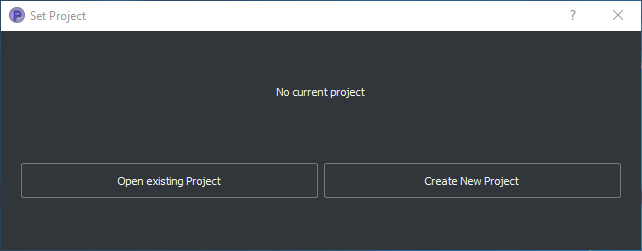
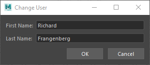
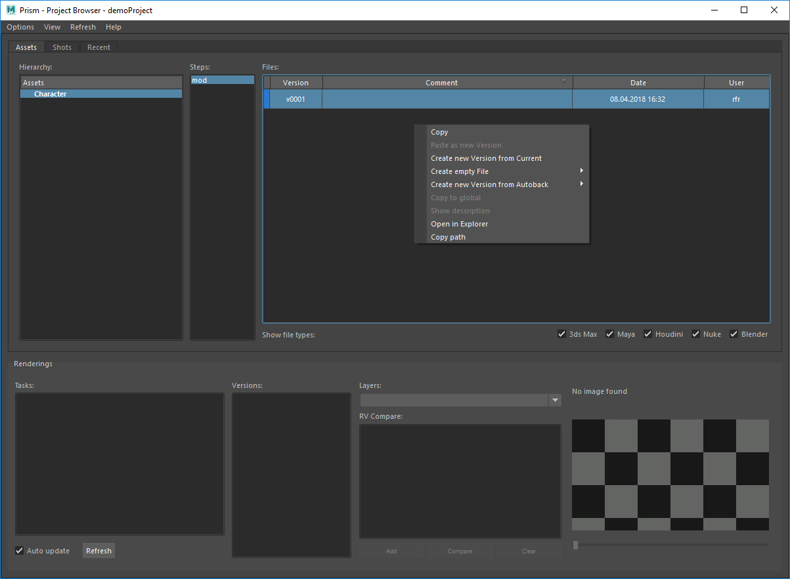
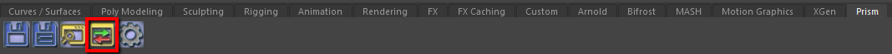
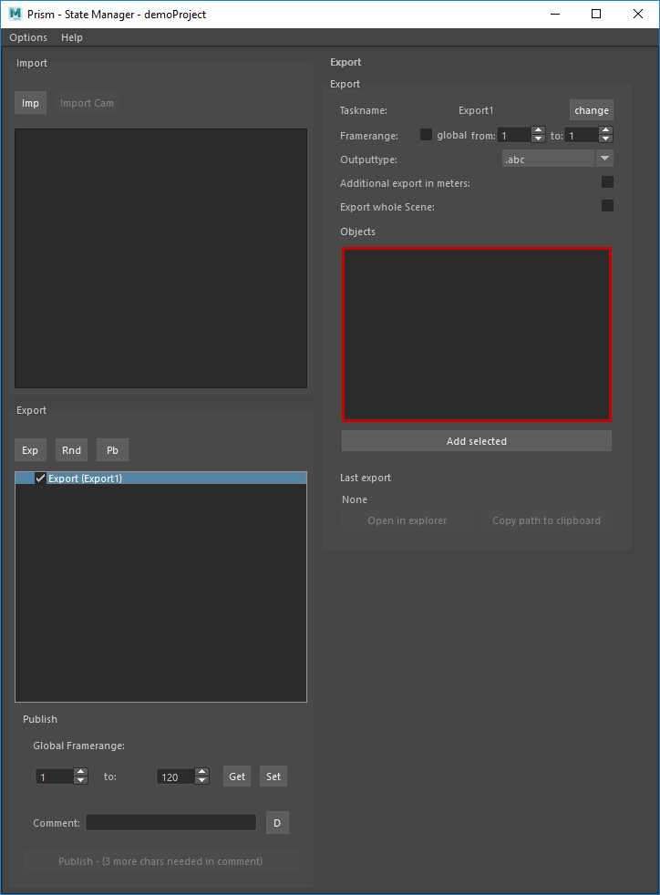
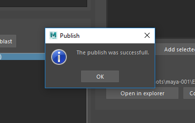
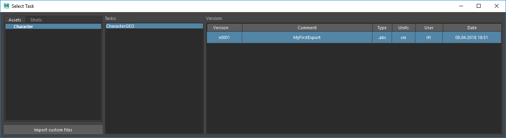
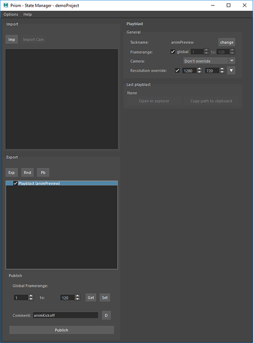
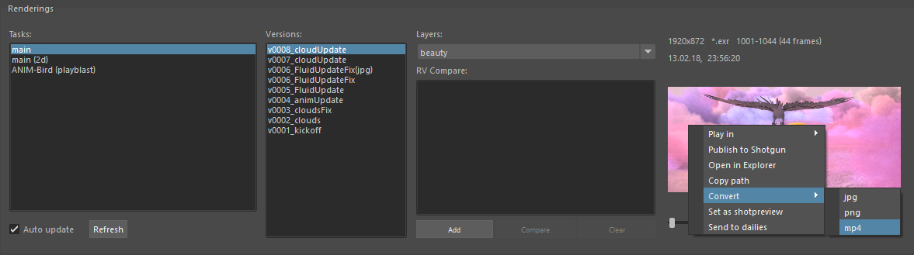

Getting Started
*****************

This overview describes the basic workflow of the Prism Pipeline. For more details about specific options and features go to the corresponding pages in this documentation.

Installation
===================

Go to the downloads page and download the latest version of Prism: https://prism-pipeline.com/downloads/
Follow the instructions of the :ref:`Installation<Installation>` section to set up Prism on your PC.

Create a project
===================
If you installed Prism for the first time, a dialog shows up after the installation, which ask you to open an existing project or to create a new one.

If you have accidentally closed the dialog, you can reopen it by clicking on the Prism Tray-Icon (the Prism symbol on the right side of your task bar) or by typing "PrismProjectBrowser" in the start menu search.

Click "Create new project" to open the "Create Project" dialog. Set a name and a path for your new project. Each option has a tooltip to give you detailed information about its functionality.

.. image:: images/CreateProject.png

Click "Create Project" to finish the project setup and create your first project.

Create scenes
===================

The next step is to create scenefiles, where you can save your work in. For this you need to open the Prism "ProjectBrowser". You can open it by clicking on the Prism Tray-Icon, by typing "PrismProjectBrowser" in the start menu search or by opening a DCC application (e.g. Maya, Houdini). The ProjectBrowser opens automatically during the program startup.

If this is the first time you use Prism, a dialog pops up and ask for your name. The name is used to identify, which user created which scenefiles. :ref:`More information<dlgUserName>`

In the ProjectBrowser you can create scenefiles in the "Assets" and in the "Shots" tab. Before you can create a scenefile you have to create an asset/shot. You can do this through the context menu (right-click) or by double clicking in a empty area of the asset/shot list. You also need to create a pipeline step in the "Steps" list. You can to this by selecting an asset/shot and double clicking in the steps list.

When you have a step selected (in the "Shots" tab you need to select a category) you can create a new scenefile in the "Files" list. Open the context menu (right-click in the files list) and choose "Create empty file" or "Create new version from current" (only available if you are inside a DCC application).

If you are in a DCC app the new scenefile gets opened immediately. Otherwise you can double click the version in the ProjectBrowser to open it.

To create new versions of your scenefile you can use the "save" option in the Prism shelf/menu of your DCC app or the different options in the context menu of the ProjectBrowser.

Export objects
===================

To exchange data between different scene files, the data (or objects) need to be exported. Only data that was exported from one scene can be imported into another scene. This is useful for example when a character asset should be imported to different shotscenes. Also, when you want to switch to another pipeline step and you want to bring the objects into another software, you need to export the objects.

To export objects with Prism you have the use the "StateManager" tool. This tool can be found in the Prism shelf/menu of your DCC app.

The second list on the left side of the StateManager is the list of export states. To export objects, you have to create an export state. You can do this by clicking the "Export" button or through the context menu of the export list. When you created an export state, select the state to see its properties on the right side of the StateManager.

If the "Export whole scene" option is unchecked only objects in the "objects" list will be exported. Select the objects you want to export in the scene and press the "Add selected" button to add them to the list. You can remove objects from the list through the context menu.

It’s a good practice to set a meaningful taskname for each export. For example: "CharacterAnim" or "EnvironmentGeo".

Now you need to execute the export state to export the objects in its list. You do this by publishing your scene:
Set a comment (e.g. "FasterAnimation") in the comment field at the bottom left of the StateManager and press the "Publish" button to execute all states in the export list. A popup shows up when the export is done.

During the publish your scene was saved as a new version. Now you can close the StateManager and your scenefile if you like.

Import objects
===================

After you have exported objects from one scene you usually want to import them into another scene. Create a new scene through the ProjectBrowser in which you want to import your objects. In Prism imports are managed through the StateManager like exports. Open the StateManager from the Prism shelf/menu and click the "Import" button above the import list. The "Select Task" dialog opens and shows you all exports from all different DCC apps in your current project.

Select an asset/shot and a taskname to show all versions of this task on the right side. To import a version double click it. The "Select Task" dialog closes and a new import state gets created in the StateManager. The version is now imported to your scene and you can close the StateManager.

Create a playblast of a scene
======================================

A playblast is a viewport preview of your current scenefile. When working on a project you can use playblasts to preview an animation or simulation without waiting for renderings.

Creating playblasts is done through the StateManager, similar like exporting objects. Open the StateManager from the Prism shelf/menu and create a playblast state in the export list by clicking the "Playblast" button or through the context menu.

Set a taskname for the playblast state and add a comment in the comment field on the bottom left of the StateManager. Press the "Publish" button to execute the playblast state and the images will be saved to disk.

After the publish is done you can playback your playblast. This is done through the ProjectBrowser. Open the ProjectBrowser from the Prism shelf/menu and select the asset/shot you are currently working on. At the lower half of the ProjectBrowser you can select your playblast task and a version of this task. Now a small preview will be displayed in the lower right corner of the ProjectBrowser. Double click it when you have RV or DJV installed to playback the image sequence. You can also open the folder in the file browser by selecting "Open in explorer" from the context menu of the preview image.

.. image:: images/pbreview.png

Render your scene
===================

Rendering a scene in Prism is much like creating a playblast only with a different state type.

You need to open the StateManager and create an ImageRender state in the export list. Now you only need to set a taskname and a publish comment before you can publish the scene. During the publish your scene will be rendered. To review your rendering, you can open the ProjectBrowser and navigate to the version and playback the sequence as described in the Create a playblast chapter.

Create a video from renderings
======================================

After you rendered your scene you can create a video file from the image sequence. Alternatively, you can bring the images into Nuke for additional compositing, but for this overview we will just convert the raw renderings.

Renderings produced by Prism are usually in the OpenEXR format, which is nice for compositing, but not very handy when you want to send it to external people, who may not have a media player which supports .exr sequences.

With Prism you can create a video file from your renderings (and also playblasts) with just a few clicks.

Open the ProjectBrowser, navigate to the asset/shot and the rendering/playblast you want to convert. Then right-click the preview image and choose "Convert->mp4".

A video file gets created and in the version list a new version appears with a "(mp4)" ending. The path to the video file is copied to your clipboard and you can select "Open in explorer" from the context menu of the version to open the location of the video file in the windows explorer.
